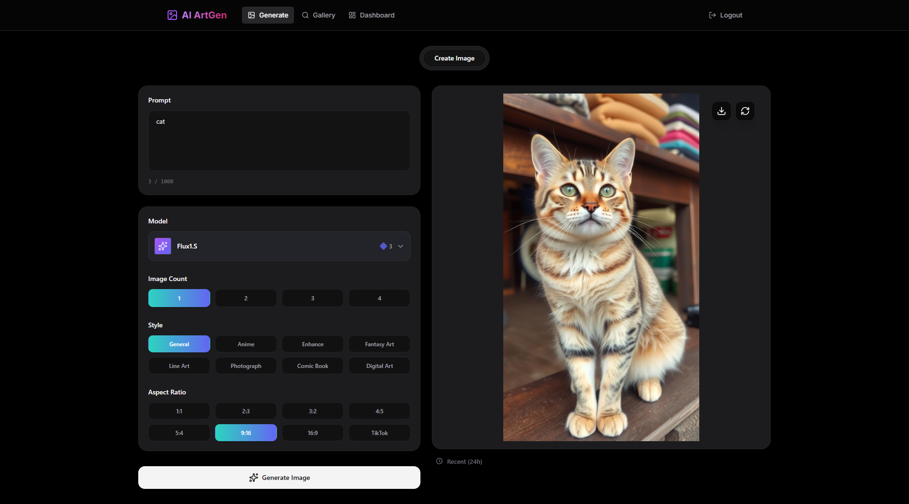
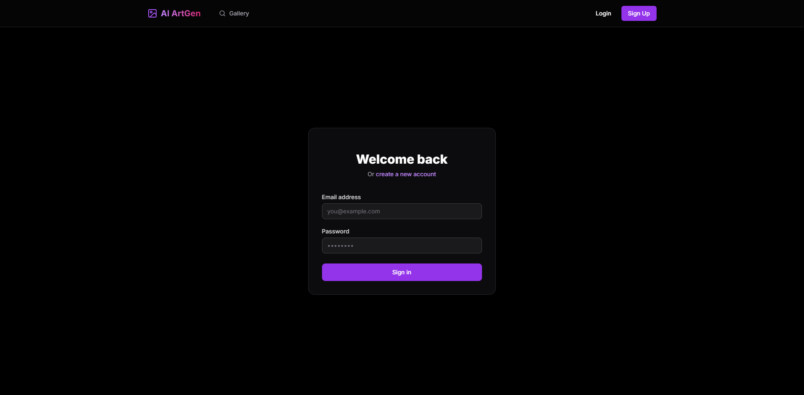
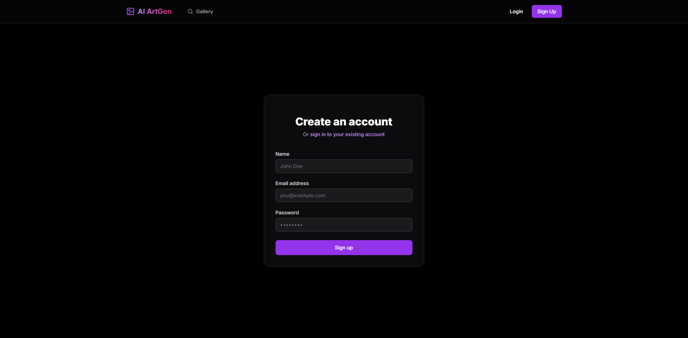

# 🎨 AI Art Generator

A state-of-the-art, full-stack AI Image Generation platform that turns your imagination into breathtaking visual reality. Built with a premium dark-aesthetic UI, advanced parametric controls, and a social community gallery.


## ✨ Why This Project?

- **Premium Aesthetics**: A custom-designed dark interface with glassmorphism, smooth animations, and a sleek modern feel.
- **Parametric Precision**: Unlike simple generators, this tool gives you control over **Aspect Ratios** (1:1, 16:9, 9:16, etc.), **Styles** (Anime, Realistic, Cyberpunk), and **Image Counts**.
- **Community First**: A Pinterest-style **Masonry Gallery** to showcase creations, with user-specific ownership and admin moderation.
- **Safety & Limits**: Real-time tracking of generation limits to manage API usage effectively.

---

## 🛠 Features

### 🖼 AI Image Generation
- Powered by high-end models like **Flux1.S**.
- **Aspect Ratio Control**: Generate vertical for TikTok/Stories, horizontal for wallpapers, or square for posts.
- **Style Presets**: Apply complex artistic styles with a single click (Anime, Enhance, Fantasy Art, etc.).
- **Live Preview**: Real-time loading states and high-quality image rendering.

### 🏛 Community Gallery
- **Masonry Layout**: A dynamic, staggered grid layout for a professional aesthetic.
- **Owner Controls**: Users can delete their own creations to keep their portfolio clean.
- **Admin Moderation**: Admins have global delete permissions for gallery curation.
- **Social Interaction**: Preview, download, and appreciate art from the community.

### 🔐 Secure Platform
- **Authentication**: Full Login and Signup system with JWT-protected sessions.
- **User Privacy**: Persists your generations and settings to your unique account.
- **Pure Black Mode**: Optimized for high-contrast, premium viewing experiences.

---

## 📷 Screenshots

### 🏠 Landing Page


### 🎨 Image Generation


### 🏺 Community Gallery


### 🔐 Authentication (Login & Signup)
| Login | Signup |
|-------|--------|
|  |  |

---

## 💻 Tech Stack

- **Frontend**: `Next.js 14+`, `React`, `Tailwind CSS`, `Framer Motion`, `Lucide React`
- **Backend**: `FastAPI` (Python), `SQLAlchemy`, `Uvicorn`
- **Database**: `SQLite`
- **AI Engine**: `Hugging Face Inference API` (using `httpx` for efficient async calls)

---

## 🚀 Installation & Execution Guide

Follow these steps to get the project up and running on your local machine.

### 📋 Prerequisites
- **Python 3.9+** installed.
- **Node.js 18+** installed.
- A **Hugging Face API Key** (Get it free at [huggingface.co](https://huggingface.co/settings/tokens)).

### ⚡ Fast Track: Run Everything with One Command

If you have both Python and Node.js installed and configured, you can start both the backend and frontend simultaneously from the root directory:

```bash
python main.py
```

*This will launch the backend at `http://localhost:8000` and the frontend at `http://localhost:3000`.*

---

### 1️⃣ Backend Setup (FastAPI) [Manual]

1. **Navigate to the backend directory**:
   ```bash
   cd backend
   ```

2. **Create a Virtual Environment**:
   ```bash
   python -m venv venv
   ```

3. **Activate the Environment**:
   - **Windows**: `venv\Scripts\activate`
   - **Mac/Linux**: `source venv/bin/activate`

4. **Install Dependencies**:
   ```bash
   pip install -r requirements.txt
   ```

5. **Configure Environment Variables**:
   Create a file named `.env` in the `backend/` folder:
   ```env
   HUGGINGFACE_API_KEY=your_hf_key_here
   SECRET_KEY=any_random_secure_string_here
   ALGORITHM=HS256
   ACCESS_TOKEN_EXPIRE_MINUTES=1440
   ```

6. **Run the Server**:
   ```bash
   python -m uvicorn main:app --reload --port 8000
   ```
   *Backend is now live at `http://localhost:8000`*

### 2️⃣ Frontend Setup (Next.js)

1. **Open a NEW terminal** and navigate to the frontend directory:
   ```bash
   cd frontend
   ```

2. **Install Packages**:
   ```bash
   npm install
   ```

3. **Launch the Web Interface**:
   ```bash
   npm run dev
   ```
   *Frontend is now live at `http://localhost:3000`*

---

## 📖 Usage Steps
1. **Sign Up**: Create an account to start generating.
2. **Generate**: Go to the "Generate" page, enter a prompt, select your preferred Aspect Ratio and Style, and hit "Generate Image".
3. **Explore**: Visit the "Gallery" to see what others are creating.
4. **Manage**: Your generated images appear in the gallery. You can download or delete them anytime.

## ⚠️ Troubleshooting
- **API Key Error**: Ensure your `.env` file has a valid Hugging Face token with "Inference" permissions.
- **Port Conflict**: If port 3000 or 8000 is busy, you can change them in the run commands (`--port XXXX`).
- **Image Not Loading**: Ensure the backend server is running and the `static/images/` folder exists.

---

*Made with ❤️ for AI Art Enthusiasts.*


python -m uvicorn main:app --reload --port 8000 //backend
npx next dev -p 3000 //frontend